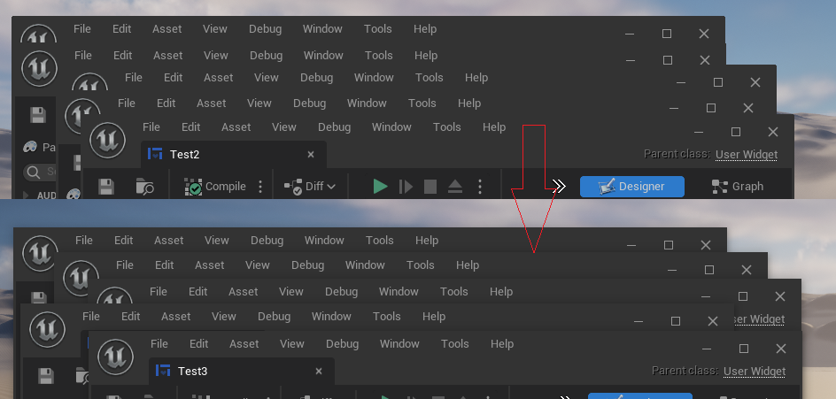
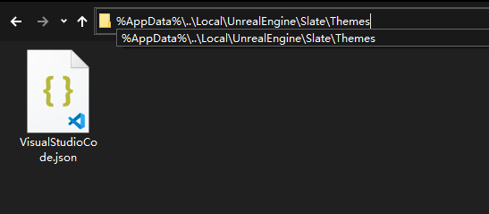
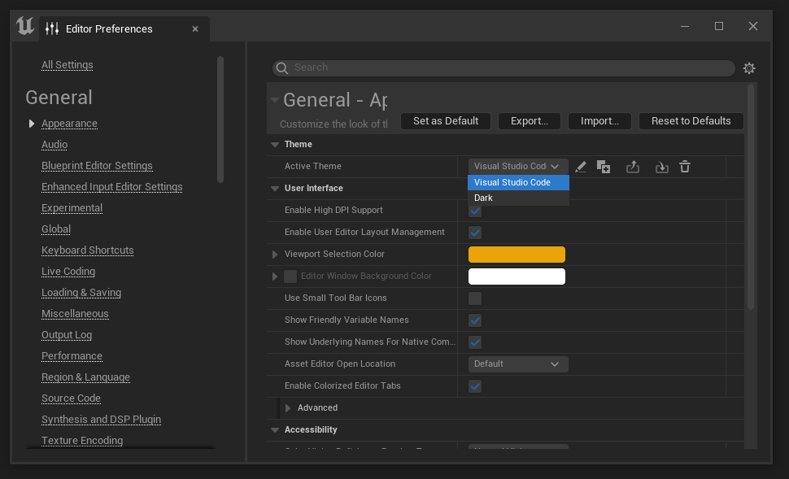
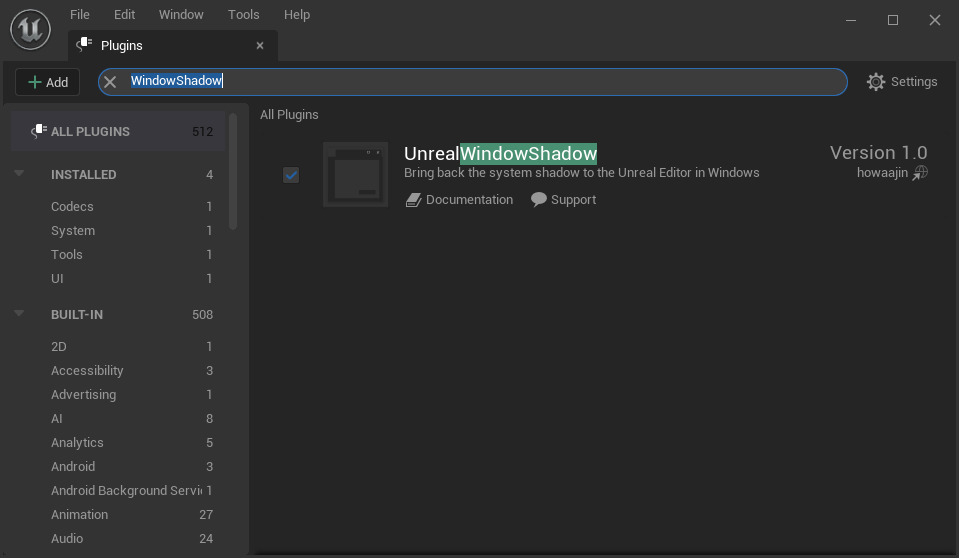
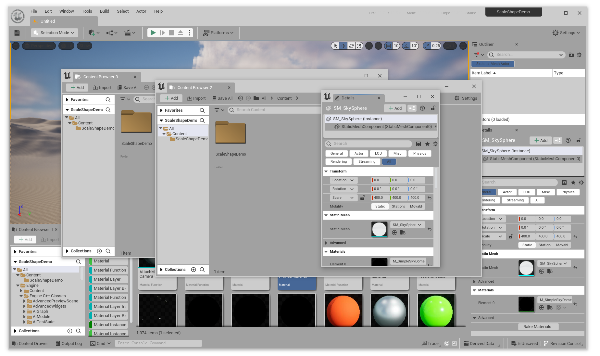
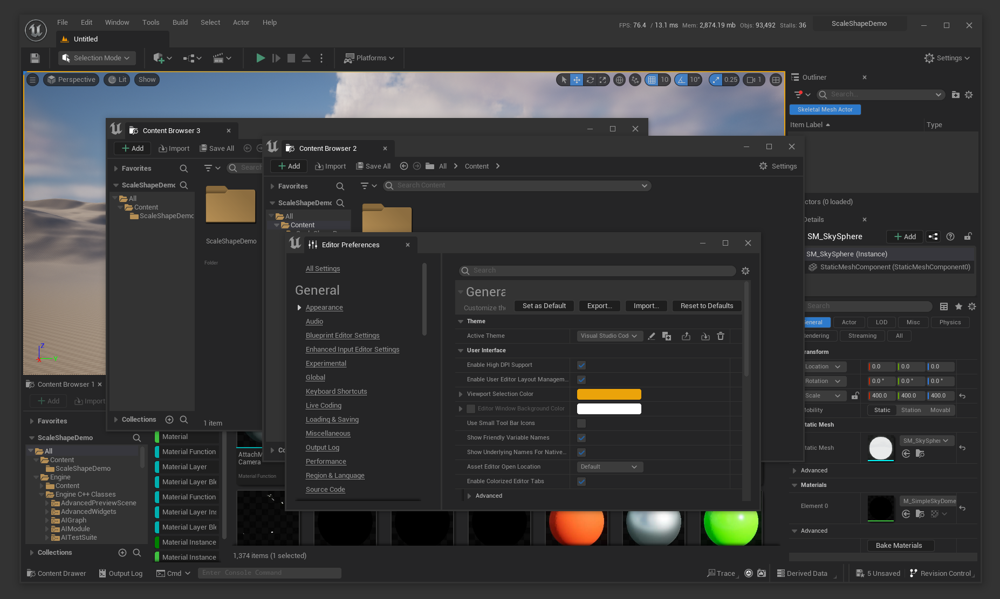
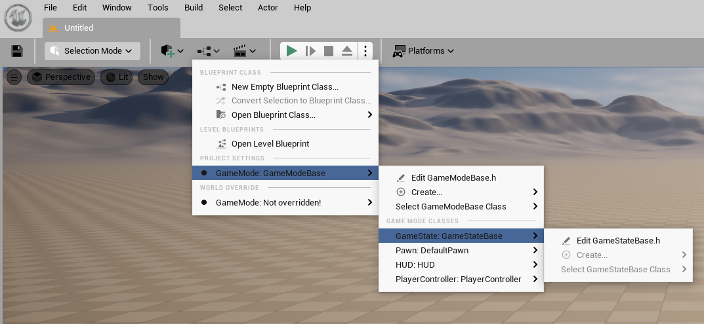

# Bring back the system shadow to the Unreal Editor in Windows

## Introduction

* Unreal has redrawn all the Windows's window elements, but they did not add window shadows.
When you want to use a flat theme, the editor window becomes difficult to distinguish the boundaries.

    

* [This plugin](https://www.unrealengine.com/marketplace/slug/cde82875e27446b6b13799335c0889db) has hacked their implementation to bring back the system window shadows while removing their rounded corners. Additionally, it speeds up the response time when opening windows.  

## Usage

To clearly see the changes, I suggest using a flat editor theme. You can use my [Visual Studio Code theme](BorderlessLight.json).  
Download and place it in the directory

    `%AppData%\..\Local\UnrealEngine\Slate\Themes`

    

  Then launch Unreal Engine and select it in `Edit->Editor Preferences->Appearance->Theme`

  

  And finally enable this plugin in `Edit->Plugins`

  

Here are my two themes, which remove the original editor's border and rounded corners, using shadows to distinguish windows. 

  [Light](BorderlessLight.json) (Warning, the Light theme is not perfect in the current version of the engine, as many colors are hardcoded and cannot be changed)
  

  [Dark](BorderlessDark.json)
  

## Update

  Enabled for menus

  